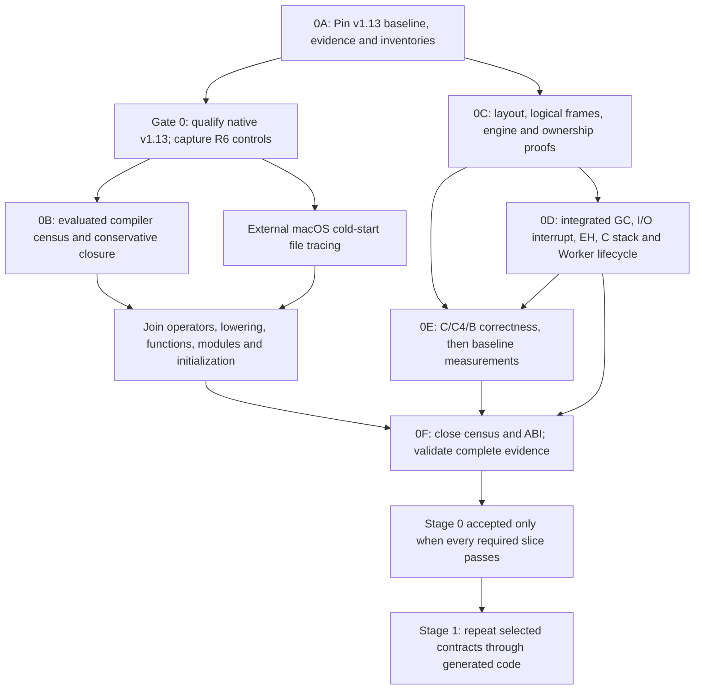

# Stage 0 workflow

The native census requires a qualified native build of the implementation revision. Architecture experiments may start independently. Historical Gate 0 at `4ca4df4` does not satisfy Gate 0 for v1.13. Both tracks must join before Stage 0 acceptance.

The initial harness is an implementation aid within 0C. It does not complete that subgate. Census distributions refine 0E's representative workloads but do not prevent earlier correctness experiments. Static unresolved edges remain visible even if no corresponding load appears in a trace. Source and target-state instrumentation is internal to the compiler; load-order observation uses an external macOS file-activity tracer, not `%fasload` hooks.

The [product-risk measurement plan](stage0/product-risk-plan.md) joins module granularity and cold installation with ABI comparisons before a recommendation. Native census work and an authorized experimental pass-2 slice can proceed before Stage 0 acceptance, with explicit provisional contracts and their own evidence. Such a spike does not mean Stage 1 has been accepted or that any Stage 0 requirement has been waived.
