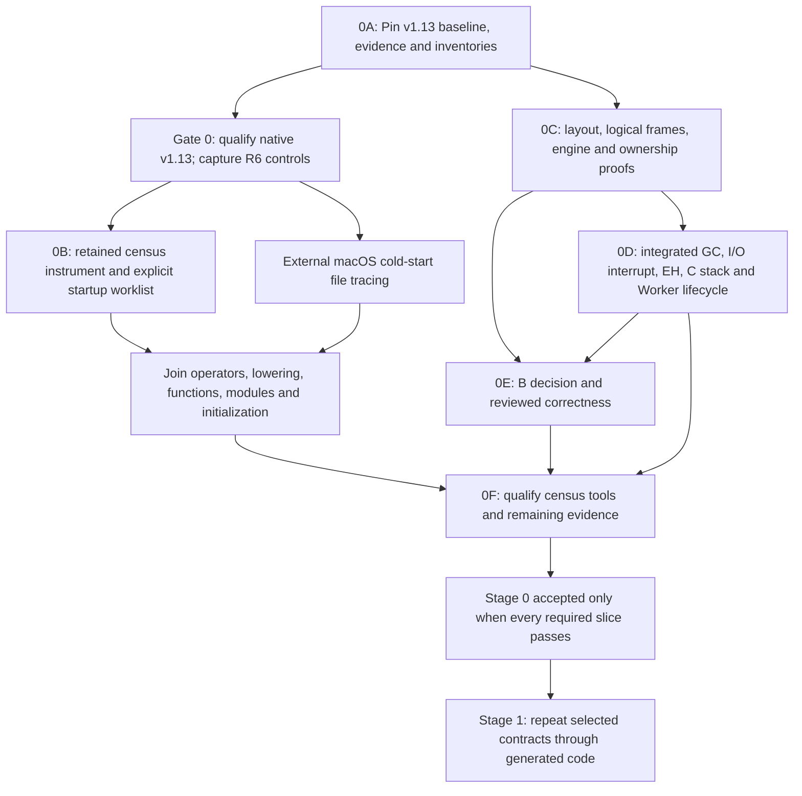

# Stage 0 workflow

The native census requires a qualified native build of the implementation revision. Architecture experiments may start independently. Historical Gate 0 at `4ca4df4` does not satisfy Gate 0 for v1.13. Both tracks must join before Stage 0 acceptance.

The initial harness is an implementation aid within 0C. It does not complete that subgate. Census distributions refine 0E's representative workloads but do not prevent earlier correctness experiments. Static unresolved edges remain visible even if no corresponding load appears in a trace. Source and target-state instrumentation is internal to the compiler; load-order observation uses an external macOS file-activity tracer, not `%fasload` hooks.

The [product-risk plan](stage0/product-risk-plan.md) retains startup, scale and module-granularity work. The [B engineering choice](stage0/abi-choice.md) removes comparative timing from the implementation path. A qualified census and an authorized experimental pass-2 slice can proceed before Stage 0 acceptance, with B as the ABI and their own evidence. This does not waive correctness or claim that Stage 1 is accepted.

The next census work is qualifying the [on-demand tools](stage0/on-demand-census.md) and their explicit worklist under the user's 15 September decision. Exhaustive native computed-call bounds no longer gate Stage 0; observed targets remain scenario-specific witnesses and unresolved populations stay visible. The complete-closure checker remains strict. Stage 1 must implement and execute its required bootstrap dependencies and initializers. Functional shared-compiler changes still require an authorized author. Implementation starts from pristine U1, without the observation patch or images. Missing workload weights do not block B; use the instrument for concrete dependency questions and later representative product workloads.
